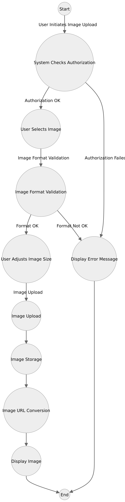

# Project Documentation

## Project Information

**PROJECT NAME:** Blog/Posts – Internal Communication Platform

**FEATURE:** Images – Picture Upload Feature

**TEAM:** Gaurav Hajare, Srivasthavi Mannepula

**ABOUT THE FEATURE:**

The Images – Picture Upload Feature is designed to empower users with the capability to upload images for various purposes within the platform. Users can upload images for their profile photos, post images in their content, or utilize images in other areas of the platform. This feature also provides users with the flexibility to adjust the height and width of the images before uploading.

**IMPLEMENTATION PLAN:**

1. Spring Application Creation for Testing:
   Initially, we will develop a Spring application to facilitate image upload and display functionality.

2. Custom AOP (Aspect Oriented Programming) Annotations:
   We will design custom AOP annotations to manage the file (image) upload process from the user's device. This includes handling the conversion of file URLs to images. This basically handles tasks like connecting to the internet, fetching the picture, and making sure it's displayed correctly on your screen. So, when we say "converting file uploaded URLs to images" in Spring, we mean this process of letting the program find and show your pictures easily, just by using their web addresses.

3. Integration Support:
   Our plan also includes assisting other teams in integrating this feature into their respective components where it may be required.

## Flowchart

**CURRENT STAGE:**

At present, we have successfully created a dedicated application that allows users to upload images from their local systems and view them within the platform. We are currently in the process of developing the custom annotation to further enhance this functionality.
